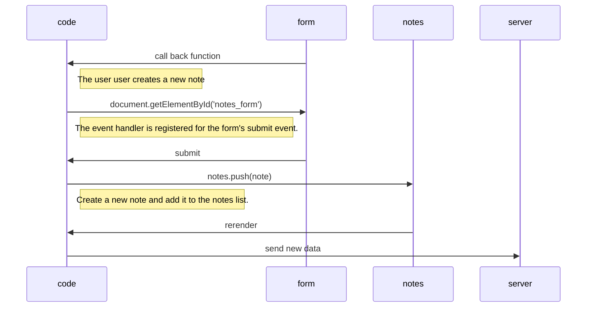

```mermaid

sequenceDiagram
    participant code
    participant form
    participant notes
    participant server

    form->>code: call back function
    Note right of code: The user user creates a new note 

    code->>form: document.getElementById('notes_form')
    Note right of code: The event handler is registered for the form's submit event.

    form->>code: submit    

    code->>notes: notes.push(note)
    Note right of code: Create a new note and add it to the notes list.  

    notes->>code: rerender

    code->>server: send new data

```